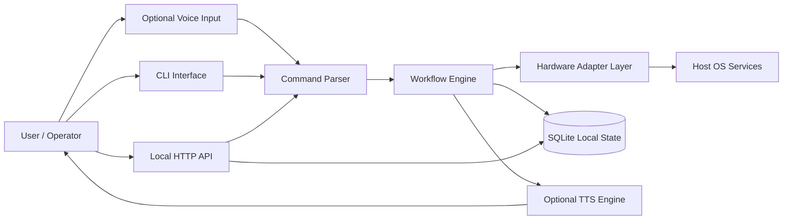
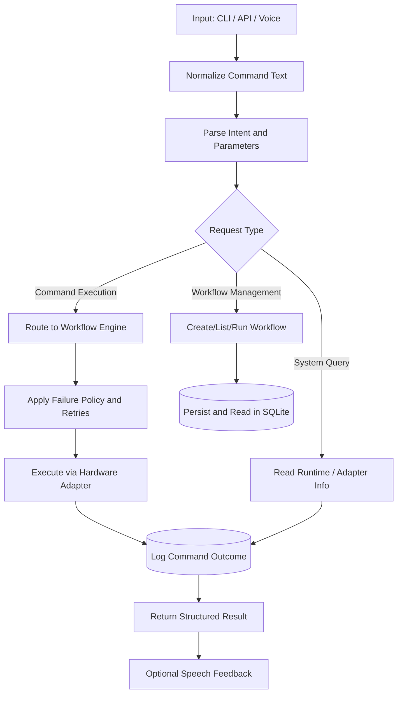
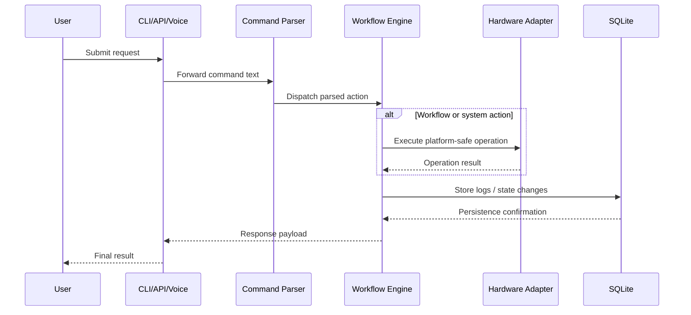

# ViperOS

ViperOS is a headless, local-first automation runtime designed for private on-device control. It provides a CLI and local HTTP API, with optional voice input and text-to-speech feedback, while keeping execution and storage on the local machine.

## Product Description

- Purpose: orchestrate local automation workflows through simple command-driven interactions.
- Runtime model: no cloud dependency, no GUI requirement, and cross-platform adapter-based execution.
- Control paths: CLI, local API requests, and optional voice-to-command input.
- Safety posture: local authentication, local persistence, and explicit confirmation objects for sensitive actions.

## File Layout

```text
ViperOS/
├─ README.md
├─ LICENSE
├─ config.yaml
├─ viper-os-core.plain
├─ template/
│  ├─ base.plain
│  └─ resources/
│     └─ run_unittests_python.ps1
└─ test_scripts/
   └─ run_unittests_python.ps1
```

### What Each File Represents

- `viper-os-core.plain`: main domain and functional specification for core behavior.
- `template/base.plain`: shared implementation constraints and baseline requirements.
- `config.yaml`: template/test script configuration values.
- `template/resources/run_unittests_python.ps1`: reference PowerShell test runner script template.
- `test_scripts/run_unittests_python.ps1`: project-level test runner used to execute isolated Python test runs.

## Overall Architecture



## Dataflow Chart



## User Interaction / Request Diagram


